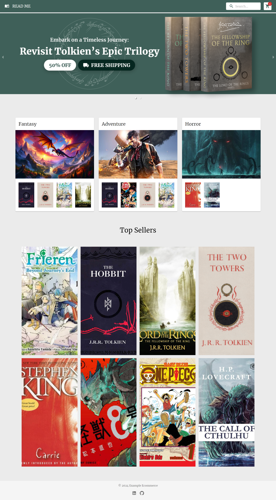
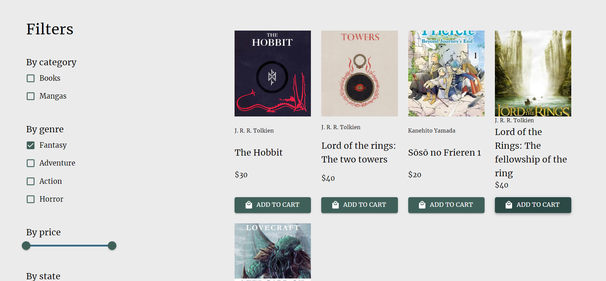
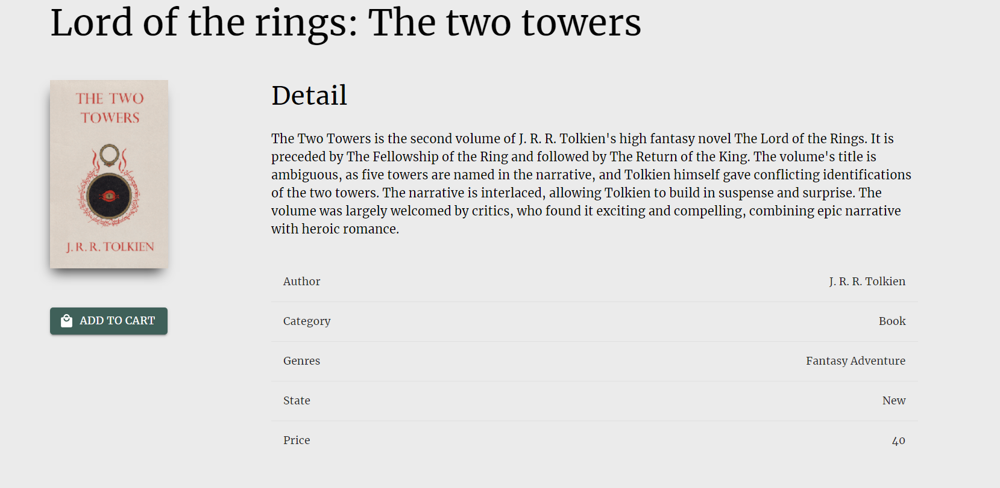
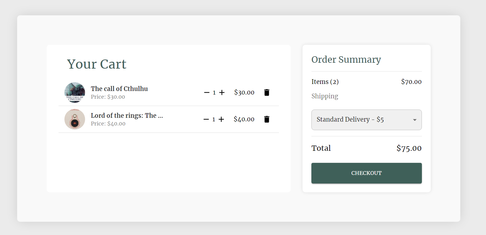
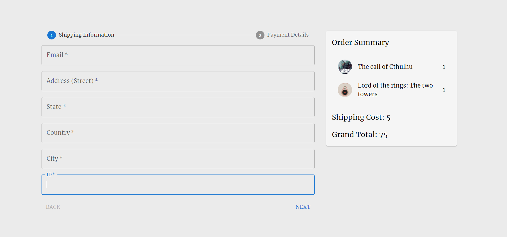
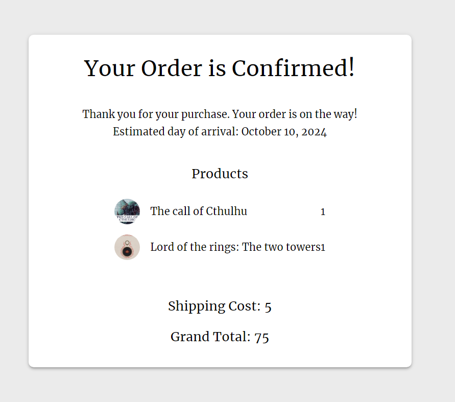

# **MOVIES BROWSER**

## ABOUT

The objective of this project is to go further with React and the posibilitys that it brings to us. We includes context and custom hooks for this project.

 
    

## Skills used

 
    

## WEBSITE STRUCTURE / HOW TO USE IT

### ✦ NavBar

On the top of the document I included a navigation bar with a search bar and the cart button.

 
    

### ✦ Home section

Home is just to show a carousel with promotions, a few cards of book genres and a top seller section.

### ✦ Filtered

This section is to be able to filter between books.

 
    

### ✦ Detail

When you click a book cover it delivers you to this page that show all the details of that book.

 
   

### ✦ Cart

Once you finish choosing the books you want, if you click at the cart button it will show this page to choose the shipping and the checkout button.

 
   

### ✦ Checkout Page

At this page you must fill with your information to pay and finish the process.

 
   

 
   

## NEW KNOWLEDGE APPLIED

### ✦ React

In this case, as is a project for the FrontEnd career of ADA ITW, I aplied all the past knowledge from the other projects and for the first time I used context and custom hooks for react.

## RESOURCES

- CSS Framework -> [Material UI](https://mui.com/material-ui/)
- Data -> [TMDB](https://developer.themoviedb.org/docs/getting-started)

## CONTACT ME

If you are interested in contacting me, as I say it on the project, you can find me on the following links:

- [LinkedIn](https://www.linkedin.com/in/romina-rao-50a61a1ba/)
- [raoromina96@gmail.com](mailto:raoromina96@gmail.com)
- [Instagram](https://instagram.com/renga.art/)
- [Check my other GitHub repositories](https://github.com/RomiRao?tab=repositories)
